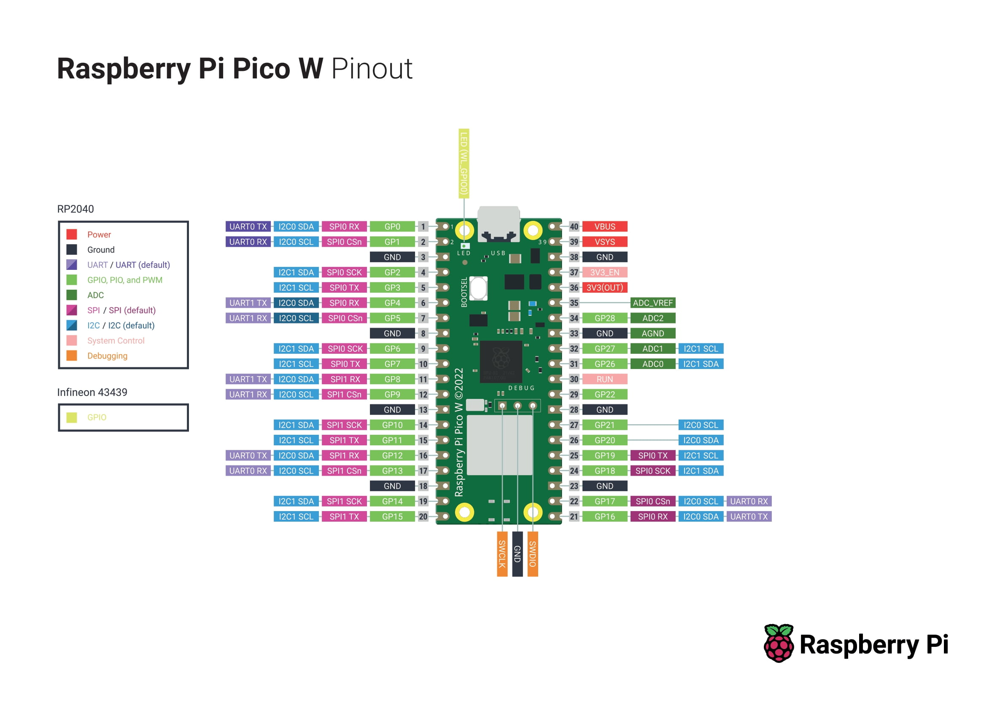
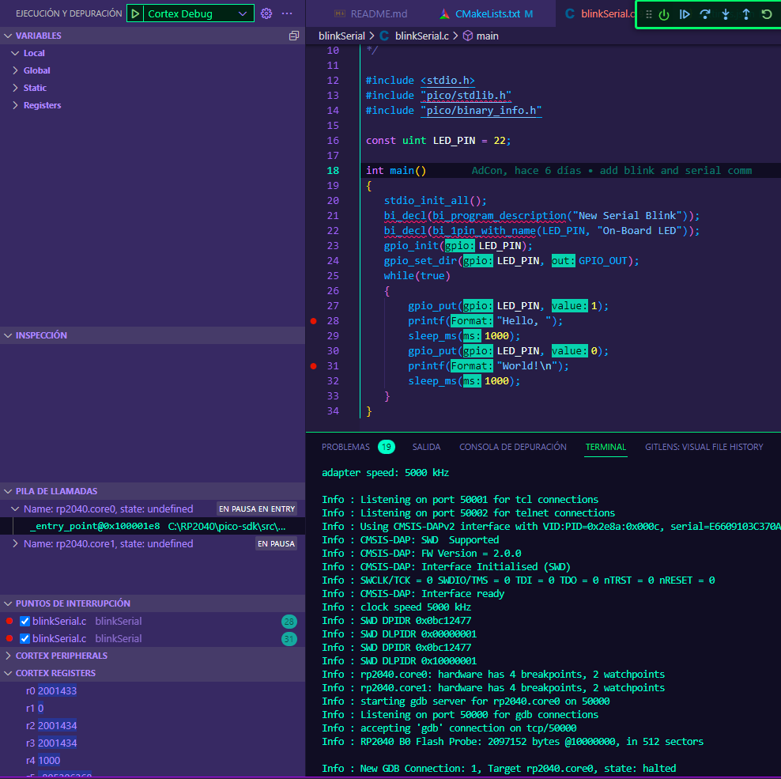

# Raspberry Pi Pico W Setup
Testing Raspberry Pi Pico W. Blinking LED and enabling serial USB communication.

## Blinking LED
First, RP2040 has to be flashed with simple blinking LED plus sending "Hello, World!" by serial communication.

## Debugger
Setting up debugger helps to understand what's inside RP2040. Allows to flash it without BOOTSEL button.

## GitHub Actions
Test with GitHub Actions were done. Now releases are done automatically as pushes to branch "master" keep coming.